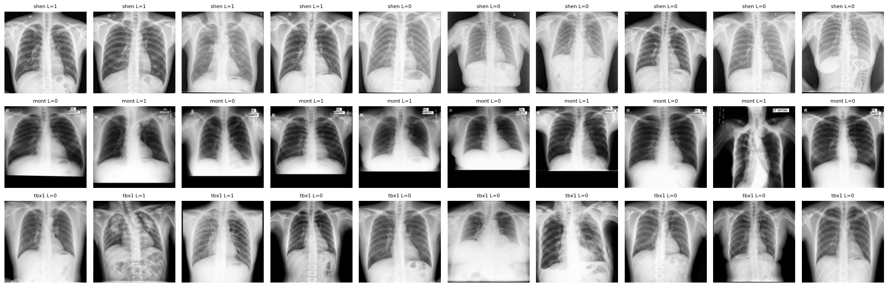
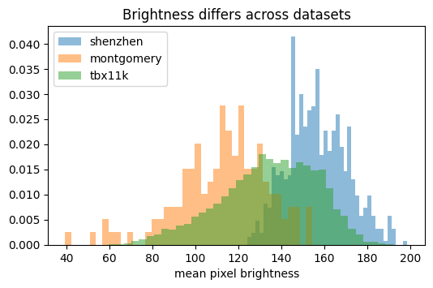
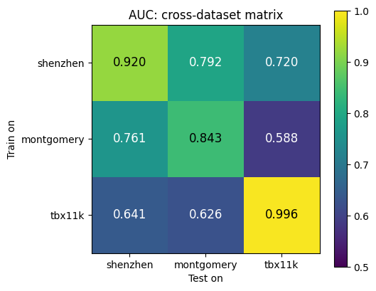
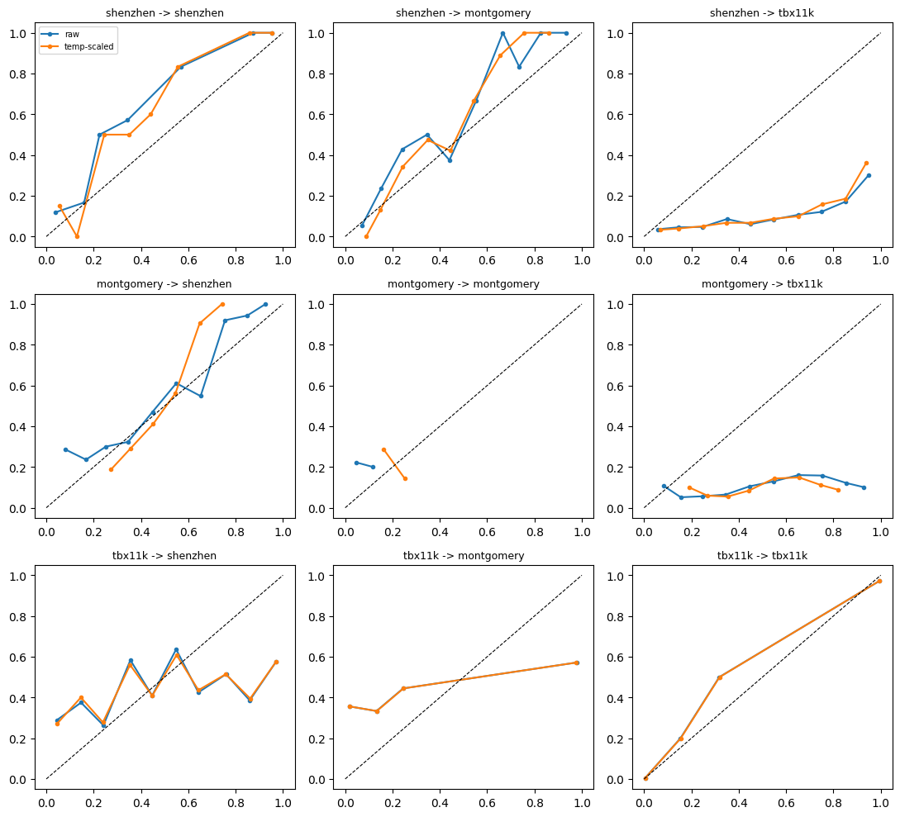
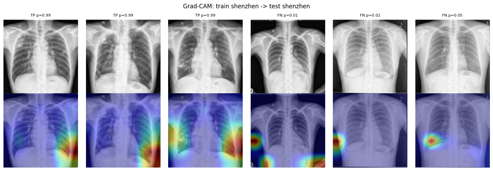
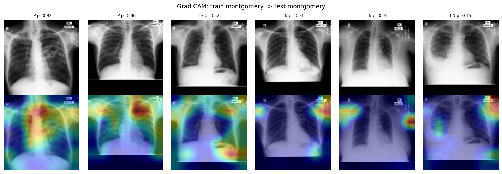
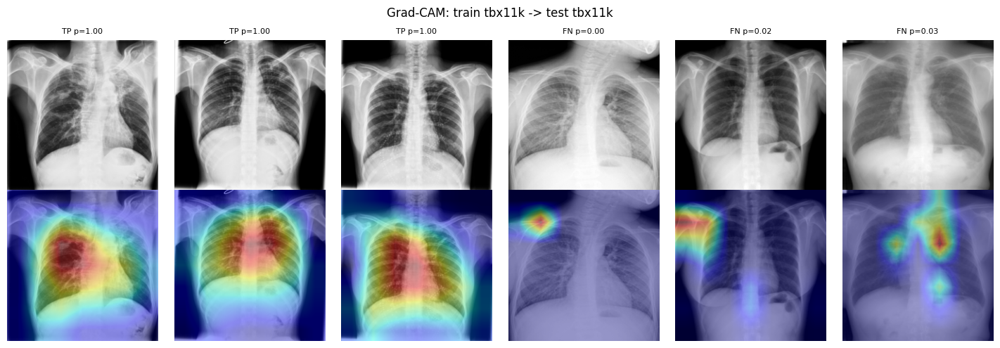
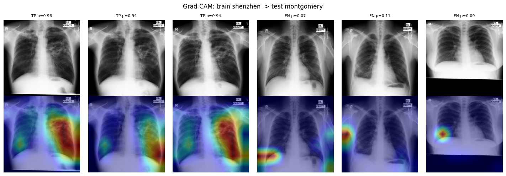
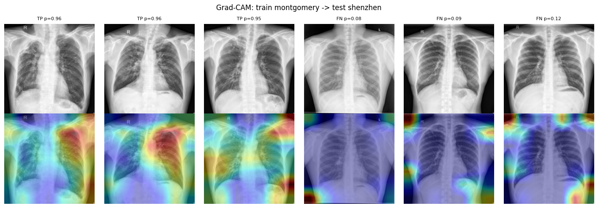
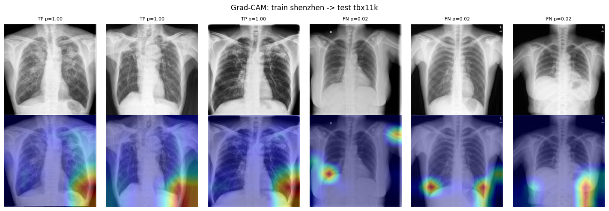

# Cross-Dataset Generalization of Deep Learning for Tuberculosis Detection on Chest X-rays

A DenseNet-121 classifier reaches AUC 0.84–0.996 on the dataset it was trained on, but how does it behave on chest X-rays from a **different hospital, scanner, and protocol**? This project trains one model per public TB dataset and evaluates every model on all three, producing a 3×3 cross-dataset matrix, then digs into **why** performance drops (calibration, threshold shift, Grad-CAM, failure analysis).

**Contact:** nimraabdulhaqq@gmail.com

> **Research / educational project only. Not a medical device and not for clinical use.**

---

## Table of contents
1. [Key findings](#1-key-findings)
2. [Datasets](#2-datasets)
3. [Method](#3-method)
4. [Results](#4-results)
5. [Analysis: why does generalization fail?](#5-analysis-why-does-generalization-fail)
6. [Limitations](#6-limitations)
7. [Repository structure](#7-repository-structure)
8. [How to reproduce](#8-how-to-reproduce)
9. [References](#9-references)

---

## 1. Key findings

- **Every model loses performance on unseen datasets.** AUC drops of 0.08 to 0.37 versus in-domain (Section 4).
- **The strongest in-domain model generalizes worst.** The TBX11K model scores AUC 0.996 in-domain but only 0.64 (Shenzhen) and 0.63 (Montgomery) elsewhere.
- **A threshold chosen on the source validation set does not transfer.** At the source threshold, the Montgomery model flags almost everything as TB on Shenzhen/TBX11K (specificity ≈ 0.00), while the TBX11K model misses most TB on Montgomery (sensitivity 0.12).
- **It is not only a threshold problem.** Even with a threshold re-tuned on the target data for 90% sensitivity, specificity stays at 0.17–0.30 for most cross-dataset pairs, so the ranking quality itself degrades.
- **Calibration is poor under shift** (ECE up to 0.42) and temperature scaling fitted on the source validation set does not fix it.
- **Grad-CAM suggests shortcut learning.** The Montgomery model repeatedly attends to the "PA ERECT" text marker, and the Shenzhen model attends to lateral/lower image edges rather than the lung parenchyma (Section 5.3).

---

## 2. Datasets

| Dataset | Images | TB | Non-TB | TB % | Original size (median) | Mean brightness | Mean contrast |
|---|---|---|---|---|---|---|---|
| Shenzhen | 662 | 336 | 326 | 50.8 | 2744×2937 | 156.7 | 63.0 |
| Montgomery | 138 | 58 | 80 | 42.0 | 4020×4892 | 112.9 | 82.2 |
| TBX11K | 8,401 | 801 | 7,600 | 9.5 | 512×512 | 134.2 | 64.2 |

- **Shenzhen** and **Montgomery** (US National Library of Medicine): labels come from the filename suffix (`_0` normal, `_1` TB).
- **TBX11K**: labels come from the folder name (`healthy`, `sick`, `tb`). `tb` = TB (801 images, includes latent TB), `healthy` and `sick` (other lung disease, no TB) = non-TB. The official `test` folder is unlabeled and skipped (3,878 images skipped, 8,401 used).
- **Note on label definition:** TBX11K's non-TB class contains patients with *other diseases* (3,800 "sick" images), whereas Shenzhen/Montgomery non-TB are mostly healthy. The TBX11K task is therefore not identical to the other two.

Sample images (10 random per dataset) and brightness distributions show the scanner/protocol differences between datasets:





---

## 3. Method

| Item | Setting |
|---|---|
| Model | DenseNet-121 (`timm`), ImageNet-pretrained, 1 output logit |
| Input | Grayscale resized to 224×224 (bilinear), replicated to 3 channels, ImageNet mean/std |
| Splits | Stratified 70/15/15 train/val/test per dataset, seed 42 |
| Loss | `BCEWithLogitsLoss` with `pos_weight = n_neg / n_pos` of the training set (≈1× for Shenzhen/Montgomery, ≈9× for TBX11K) |
| Optimizer | AdamW, lr 1e-4, weight decay 1e-4, batch size 32, mixed precision (AMP) |
| Epochs | Shenzhen 15, Montgomery 25, TBX11K 8 (early stopping patience 6) |
| Model selection | Best validation AUC (checkpoint per epoch, resumable) |
| Augmentation | Rotation ±10°, contrast ×0.8–1.2, brightness ±0.1. No horizontal flip (heart position) |
| Evaluation | In-domain on the **test split**; cross-dataset on the **entire** other dataset |
| Operating point | Threshold from the **source validation set** for 90% sensitivity, then applied unchanged to other datasets |
| Uncertainty | 95% bootstrap CI for AUC (500 resamples) |
| Class imbalance | Handled by `pos_weight` only. Val/test sets are left at their natural prevalence (no resampling) to avoid leakage and inflated metrics |
| Extra analyses | AUPRC, ECE + temperature scaling, Grad-CAM, failure analysis by brightness/contrast |

---

## 4. Results

### 4.1 Cross-dataset AUC matrix

Rows = training set, columns = test set. Diagonal = in-domain test split, off-diagonal = full other dataset.

| Train \ Test | Shenzhen | Montgomery | TBX11K |
|---|---|---|---|
| **Shenzhen** | **0.920** [0.865, 0.971] | 0.792 [0.711, 0.859] | 0.720 [0.700, 0.739] |
| **Montgomery** | 0.761 [0.726, 0.795] | **0.843** [0.618, 1.000] | 0.588 [0.567, 0.608] |
| **TBX11K** | 0.641 [0.595, 0.682] | 0.626 [0.517, 0.717] | **0.996** [0.989, 0.999] |



AUC drop versus the in-domain value of the same model:

| Train → Test | In-domain AUC | Cross AUC | Drop |
|---|---|---|---|
| Shenzhen → Montgomery | 0.920 | 0.792 | −0.128 |
| Shenzhen → TBX11K | 0.920 | 0.720 | −0.200 |
| Montgomery → Shenzhen | 0.843 | 0.761 | −0.082 |
| Montgomery → TBX11K | 0.843 | 0.588 | −0.255 |
| TBX11K → Shenzhen | 0.996 | 0.641 | −0.355 |
| TBX11K → Montgomery | 0.996 | 0.626 | −0.370 |

> The Montgomery in-domain test set has only 21 images, so its CI is very wide (0.62–1.00). Treat that cell with caution.

### 4.2 AUPRC (important because TBX11K is imbalanced)

AUPRC should be compared with the **prevalence** (the score of a random classifier).

| Train → Test | AUPRC | Prevalence |
|---|---|---|
| Shenzhen → Shenzhen | 0.945 | 0.510 |
| Shenzhen → Montgomery | 0.772 | 0.420 |
| Shenzhen → TBX11K | 0.275 | 0.095 |
| Montgomery → Shenzhen | 0.798 | 0.508 |
| Montgomery → Montgomery | 0.878 | 0.429 |
| Montgomery → TBX11K | 0.112 | 0.095 |
| TBX11K → Shenzhen | 0.703 | 0.508 |
| TBX11K → Montgomery | 0.529 | 0.420 |
| TBX11K → TBX11K | 0.977 | 0.095 |

Montgomery → TBX11K (AUPRC 0.112 vs prevalence 0.095) is barely better than chance.

### 4.3 Operating point: threshold from source validation set (90% sensitivity target)

| Train → Test | Sensitivity | Specificity | F1 | Specificity at the target's own 90%-sens threshold |
|---|---|---|---|---|
| Shenzhen → Shenzhen | 0.902 | 0.816 | 0.868 | 0.816 |
| Shenzhen → Montgomery | 0.914 | 0.425 | 0.675 | 0.425 |
| Shenzhen → TBX11K | 0.876 | 0.321 | 0.211 | 0.275 |
| Montgomery → Shenzhen | 1.000 | 0.003 | 0.674 | 0.304 |
| Montgomery → Montgomery | 0.778 | 0.417 | 0.609 | 0.333 |
| Montgomery → TBX11K | 0.998 | 0.002 | 0.174 | 0.183 |
| TBX11K → Shenzhen | 0.435 | 0.804 | 0.535 | 0.187 |
| TBX11K → Montgomery | 0.121 | 0.912 | 0.194 | 0.175 |
| TBX11K → TBX11K | 0.808 | 0.998 | 0.886 | 0.996 |

The target-threshold column is an oracle (it uses target labels) and is shown only to separate "threshold shift" from "ranking degradation".

---

## 5. Analysis: why does generalization fail?

### 5.1 Calibration

Raw and temperature-scaled ECE. Temperature `T` was fitted on the **source validation set only** and applied unchanged to the target.

| Train → Test | T | ECE (raw) | ECE (temp-scaled) |
|---|---|---|---|
| Shenzhen → Shenzhen | 1.23 | 0.107 | 0.131 |
| Shenzhen → Montgomery | 1.23 | 0.111 | 0.091 |
| Shenzhen → TBX11K | 1.23 | 0.326 | 0.334 |
| Montgomery → Shenzhen | 1.97 | 0.065 | 0.085 |
| Montgomery → Montgomery | 1.97 | 0.188 | 0.200 |
| Montgomery → TBX11K | 1.97 | 0.416 | 0.416 |
| TBX11K → Shenzhen | 1.01 | 0.331 | 0.329 |
| TBX11K → Montgomery | 1.01 | 0.324 | 0.323 |
| TBX11K → TBX11K | 1.01 | 0.005 | 0.005 |



Takeaway: the TBX11K model is almost perfectly calibrated in-domain (ECE 0.005) but badly miscalibrated on the other datasets (ECE ≈ 0.33), and source-side temperature scaling does not repair this. Note that ECE also depends on prevalence, which differs across datasets, so the TBX11K column is partly a prevalence effect.

### 5.2 Threshold shift

The same 90%-sensitivity rule behaves in opposite ways depending on the source model:

- **Montgomery model** (small, 96 training images): scores are shifted high on the other datasets, so it labels almost every image TB (sensitivity ≈ 1.0, specificity ≈ 0.00).
- **TBX11K model**: scores are shifted low on the other datasets, so it misses most TB (sensitivity 0.43 on Shenzhen, 0.12 on Montgomery).

A fixed decision threshold cannot be moved between sites without local recalibration.

### 5.3 Grad-CAM

For each setting, the 3 most confident true positives (TP) and the 3 lowest-scoring TB cases (false negatives, FN) are shown. Top row: image. Bottom row: Grad-CAM overlay.

**Shenzhen → Shenzhen.** Activation is concentrated on the outer/lateral and lower edges of the image, including regions outside the lung fields, even for confident true positives.



**Montgomery → Montgomery.** Several cases (TP and FN) show strong activation on the **"PA ERECT" text marker** in the top-right corner. This is a non-anatomical cue that will not transfer to other datasets.



**TBX11K → TBX11K.** True positives show broad activation over the lung fields (which is what we want), while some FN cases attend to shoulder/edge regions.



**Shenzhen → Montgomery**



**Montgomery → Shenzhen**



**Shenzhen → TBX11K.** The model's attention again sits on the lower lateral edges of the image rather than on lesions.



These are qualitative examples of 6 images per figure, not a quantitative localization study. They are evidence **consistent with** shortcut learning, not proof of it.

### 5.4 Failure analysis (mean brightness / contrast of TP, FN, FP, TN)

Computed with the source threshold, for each train/test pair (full table in `notebooks/`, outputs of cell 20). Selected observations:

- On **TBX11K → Shenzhen**, false negatives are 190 of 336 TB cases (sens 0.43), and false positives (n=64) are brighter (165.3) than true negatives (158.9).
- On **TBX11K → Montgomery**, the 7 false positives are very dark (mean brightness 60.3 vs about 113–117 for the other groups). The sample is small (n=7), so this is anecdotal.
- On **Shenzhen → TBX11K**, there are 5,158 false positives against 702 true positives (precision ≈ 0.12), and false positives are brighter on average (139.1) than true negatives (124.5).
- In most other pairs the group means of brightness/contrast are close to each other, so **brightness and contrast alone do not explain the errors**. The domain shift is more than a global intensity difference.

---

## 6. Limitations

- **Single run, single seed (42), single architecture** (DenseNet-121). No variance estimate across seeds.
- **Small datasets.** Montgomery has 138 images (21 in its test split), so its numbers are noisy. Shenzhen's test set has 100 images.
- **Different label definitions.** TBX11K non-TB includes other pathologies. TBX11K TB includes latent TB. Some of the cross-dataset gap is label-definition shift, not only image-acquisition shift.
- **TBX11K in-domain AUC of 0.996** is very high. This is plausible for a large dataset, but could also reflect dataset-specific cues. This project did not test it (e.g. with lung-masked or shuffled-patch controls).
- **Resizing to 224×224** discards detail, especially for the multi-megapixel Shenzhen/Montgomery images. Applied identically across datasets.
- **Splits are random at image level.** If a dataset contains multiple images per patient, patient leakage between train/val/test is possible, and in-domain results would be optimistic.
- **Grad-CAM is qualitative** and only on a handful of images.
- **The oracle threshold column** (spec at target's own 90% sensitivity) uses target labels and is for diagnosis only.
- **Not clinically validated.**

## Possible future work
- Domain-adaptation or mitigation baselines: lung segmentation / masking, histogram matching, stronger intensity augmentation, multi-source training (leave-one-dataset-out).
- Ablation of class-imbalance handling on TBX11K (`WeightedRandomSampler`, focal loss) versus `pos_weight`.
- Multiple seeds and confidence intervals on all metrics.
- Quantitative Grad-CAM analysis (fraction of attention inside a lung mask).

---

## 7. Repository structure

```
tb-generalization/
├── README.md
├── requirements.txt
├── .gitignore
├── notebooks/
│   └── TB_Chest_X_ray__Cross_Dataset_Generalization.ipynb   # full pipeline with outputs
└── results/                                                  # figures used in this README
    ├── eda_samples.png
    ├── eda_brightness.png
    ├── cross_dataset_heatmap.png
    ├── calibration.png
    ├── gradcam_shenzhen_shenzhen.png
    ├── gradcam_montgomery_montgomery.png
    ├── gradcam_tbx11k_tbx11k.png
    ├── gradcam_shenzhen_montgomery.png
    ├── gradcam_montgomery_shenzhen.png
    └── gradcam_shenzhen_tbx11k.png
```

The notebook also writes CSVs (`eda_summary.csv`, `cross_dataset.csv`, `auprc.csv`, `calibration.csv`, `failure_analysis.csv`) and per-pair prediction files (`preds_*.npz`, `val_*.npz`) to `results/` on Google Drive when run. Model checkpoints and cached image arrays are not stored in this repo (size).

## 8. How to reproduce

The notebook is designed for **Google Colab (T4 GPU)** with Google Drive mounted. Everything (cache, checkpoints, results) is saved to `MyDrive/tb-generalization/`, and training resumes automatically if the session disconnects.

1. Open `notebooks/TB_Chest_X_ray__Cross_Dataset_Generalization.ipynb` in Colab, set runtime to **T4 GPU**.
2. Run the setup cells (GPU check, Drive mount, `pip install`, imports and config).
3. **Shenzhen and Montgomery** are downloaded automatically from the NLM server (about 4 GB for Shenzhen).
4. **TBX11K** must be obtained by you (see the TBX11K paper/project page). Place the zip at `MyDrive/tb-generalization/data/tbx11k.zip`. The notebook contains a `gdown` cell with a link to the author's own copy, so replace `TBX_LINK` with your own source.
5. Run the dataset-building cell (resize to 224, metadata, stratified splits, cached to Drive).
6. Run EDA, then the model/training/metrics definition cells, then the cross-dataset experiment cell (TBX11K takes about 43 s/epoch on a T4).
7. Run the AUPRC, calibration, Grad-CAM and failure-analysis cells.

Python dependencies are in `requirements.txt`.

## 9. References

- Jaeger S. et al. *Two public chest X-ray datasets for computer-aided screening of pulmonary diseases.* Quantitative Imaging in Medicine and Surgery, 2014 (Shenzhen and Montgomery sets, NLM).
- Liu Y. et al. *Rethinking Computer-Aided Tuberculosis Diagnosis.* CVPR 2020 (TBX11K).
- Huang G. et al. *Densely Connected Convolutional Networks.* CVPR 2017 (DenseNet).
- Selvaraju R. et al. *Grad-CAM: Visual Explanations from Deep Networks via Gradient-based Localization.* ICCV 2017.
- Guo C. et al. *On Calibration of Modern Neural Networks.* ICML 2017 (ECE, temperature scaling).

## Contact

Questions or suggestions: **nimraabdulhaqq@gmail.com**
